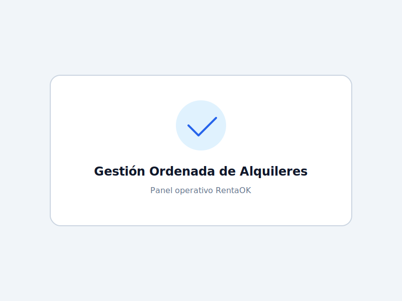
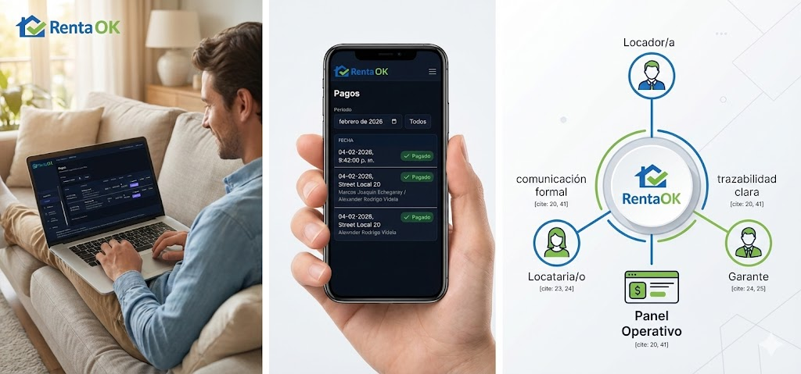
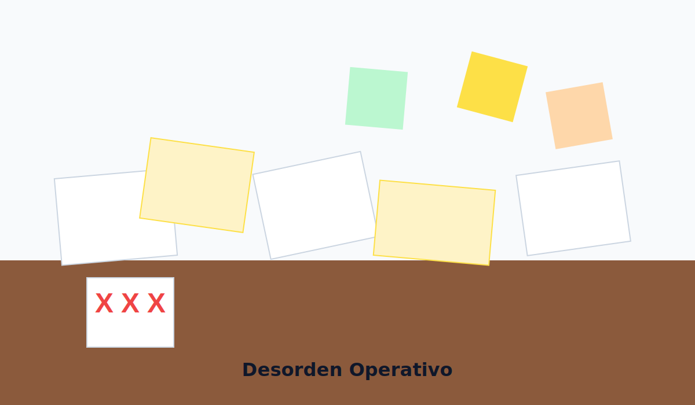
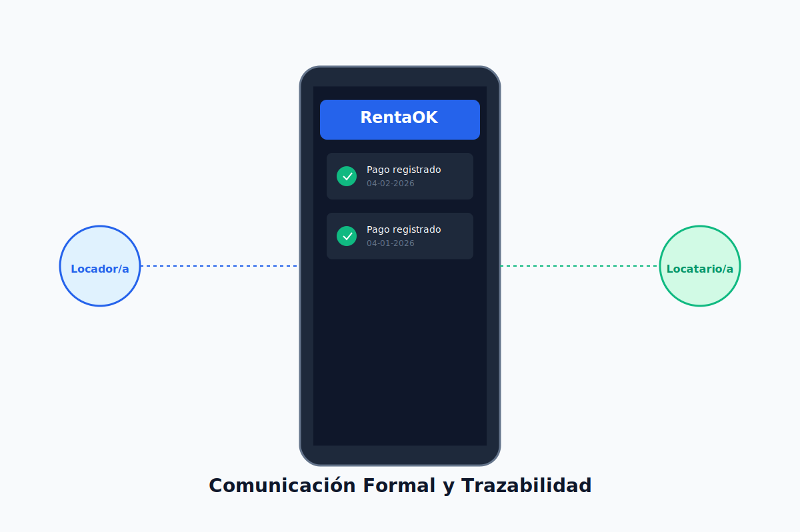
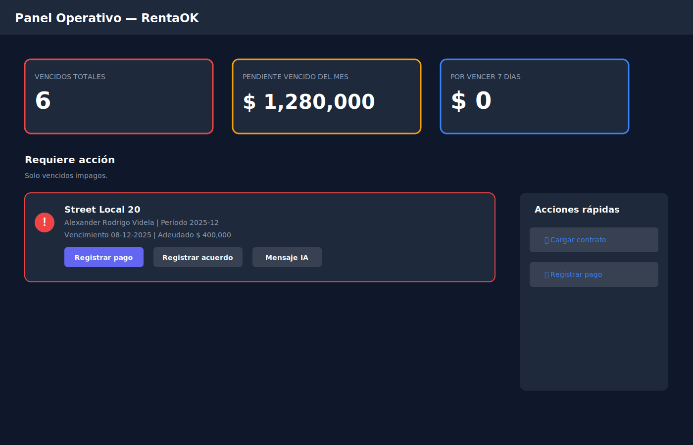
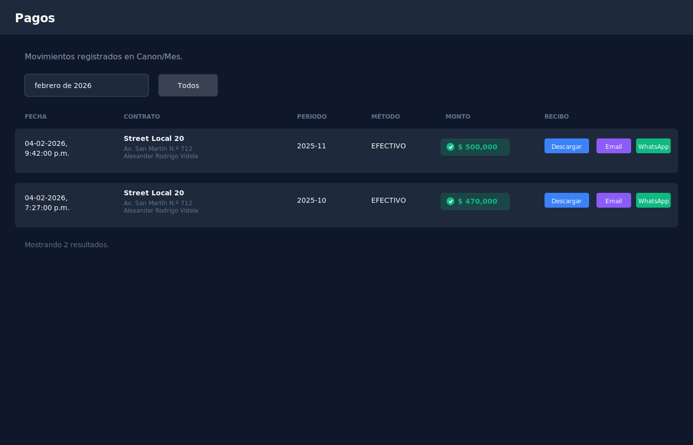

# 📸 Guía Rápida: Cómo Agregar tus Imágenes a la Landing Page

## Imágenes que tienes:

### Imagen 1: Composición (Persona + Celular + Diagrama)
Esta imagen tiene 3 partes y es perfecta para mostrar el sistema en uso.

### Imagen 2: Escritorio Desordenado + Tablet con Dashboard  
Esta muestra el contraste problema/solución.

---

## 🎯 Pasos para Agregar las Imágenes:

### Opción 1: Drag & Drop (Más Fácil)

1. **Guarda las imágenes del chat**:
   - Click derecho en cada imagen
   - "Guardar imagen como..."
   - Guárdalas con estos nombres:
     - Primera imagen → `hero-solution.jpg`
     - Segunda imagen → `problem-dashboard.jpg`

2. **Cópialas a la carpeta assets**:
   - Abre la carpeta: `C:\Users\user\.gemini\antigravity\scratch\rentaok-landing\assets\`
   - Arrastra las 2 imágenes que guardaste a esa carpeta

3. **Listo!** Las imágenes ya están en el proyecto.

---

### Opción 2: Método Screenshot (Si las imágenes están en pantalla)

1. Abre cada imagen en tu navegador o visor de imágenes
2. Presiona `Windows + Shift + S` para captura de pantalla
3. Selecciona el área de la imagen
4. Pega en Paint (`Ctrl + V`)
5. Guarda como JPG en: `C:\Users\user\.gemini\antigravity\scratch\rentaok-landing\assets\`

---

## 🔄 Actualizar las Referencias en el HTML

Una vez que las imágenes estén en la carpeta `assets/`, necesitamos actualizar 5 líneas en el archivo `index.html`:

### Cambios necesarios:

**Línea 61** - Hero Image:
```html
<!-- Cambiar de: -->


<!-- A: -->

```

**Línea 98** - Problem Desk:
```html
<!-- Cambiar de: -->


<!-- A: -->

```

**Línea 144** - Solution Screens:
```html
<!-- Cambiar de: -->


<!-- A: -->

```

**Línea 260** - Dashboard Screenshot:
```html
<!-- Cambiar de: -->


<!-- A: -->

```

**Línea 267** - Payments Screenshot:
```html
<!-- Cambiar de: -->


<!-- A: -->

```

---

## ✅ Verificar

1. Guarda el archivo `index.html`
2. Abre la landing page en tu navegador
3. Presiona `Ctrl + F5` para refrescar sin caché
4. ¡Deberías ver tus imágenes reales!

---

## 💡 Tip Pro

Si tienes más screenshots del sistema (especialmente del panel de pagos), puedes usarlos también. Solo necesitas:
1. Guardarlos en `assets/`
2. Cambiar la ruta en el HTML

---

## 🤔 ¿Necesitas Ayuda?

Si prefieres que te ayude a hacer los cambios automáticamente, solo necesito que:
1. Me pases la ruta exacta donde guardaste las imágenes
2. O me confirmes los nombres de archivo que usaste

¡Y yo actualizo todo el HTML por ti! 🚀
